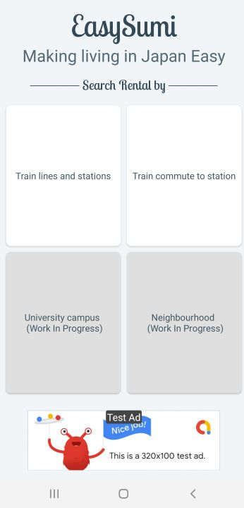
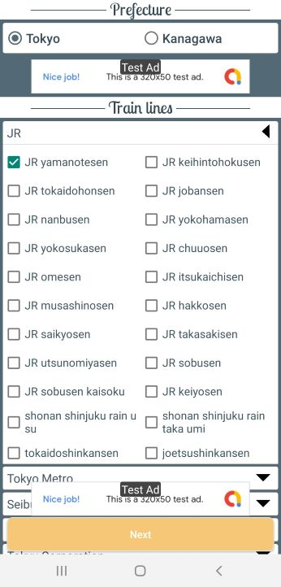
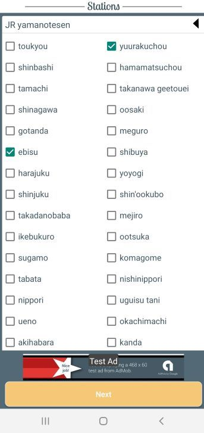
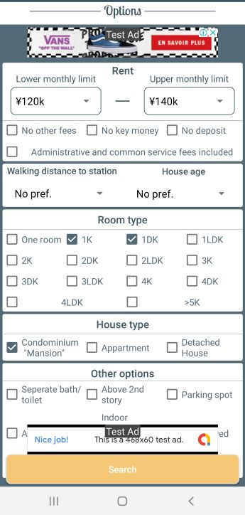
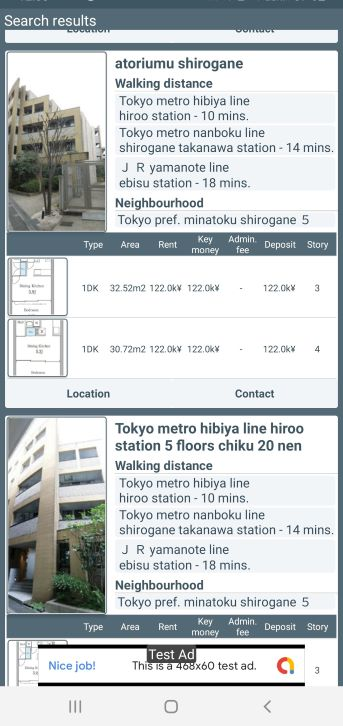

# EasySumi

This project makes it possible for Foreigners living in Japan to find rental properties using Sumo in English on their Android phones. Sumo and many other websites do not have any English compatibility other than using Google translate.

I (Jim Bartels) performed this project because I realized that there is a growing market for foreigners in Japan that do not necessarily speak Japanese and are more comfortable with using English for finding their rental properties in Tokyo.

To achieve this I developed the following:
1. A Python webscraper application that receives a Json input with search options of rental properties such as monthly rent limits, area, distance from train lines, property type and so on. This applicaton uses selenium library, which has dependencies such as chrome and therefore requires docker to be used in AWS lambda. The reason for AWS Lambda is because it significantly reduces the payments required since Lambda only runs when the webscraper is invoked by a user and is easily scalable. 
2. An Android graphical user interface that easily allows you to search for an area or train line for your rental property location and search options as described above. Hereafter it shows the results after ~30 seconds in a scrollable overview with photos of rental properties and equivalent information that could be found on the Sumo website but in English.

# Android graphical interface
This shows an example of searching for rental properties near Yuurakucho and Ebisu station on the yamanote line. This property has to be between 120k yen and 140k yen and has to be a room type 1K.

Main screen:  
  

Selecting Train lines:  
  

Selecting Train stations:  
   

Selecting Search options:  
  

Search results:  
  

# Disclaimer
This work has not been used in any commercial applications and serves only as a personal educational project. The screenshots in this project involve original work and cannot be used without permission. The Java source files have been removed since it involves access to AWS lambda and Google admob.
© 2020 Jim Bartels  
